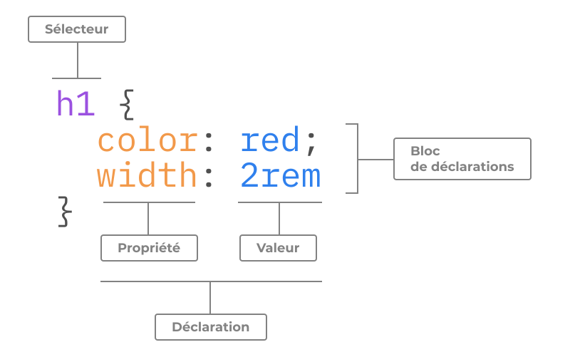

## Le langage

`CSS` pour *Cascading StyleSheet* (feuille de styles en cascade) est le langage de mise en forme des pages `html` et `CSS` permet :

 1. De *sélectionner* un ou un ensemble d’éléments;
 2. De *modifier des propriétés* (propriétés visuelle la plupart, comme la largeur);
 3. Et d’*attribuer une valeur* à ces propriétés (par exemple : 130px);
  

---

  
## Le modèle de boîte
## Les sélecteurs
## La cascade
## Spécficité
## Héritage
## Couleurs, dimensions
## Mise en paqe
## Flexbox
## Grid
## Propriétés logiques
## Espaces
## Pseudo-éléments et pseudo class
  - États
## Bordures, contours, ombres
  - Élements d’habillage
## Focus
## Z-index
## Fonctions
## Dégradés
## Animations
## Filtres
## Mélanges (blend modes)
